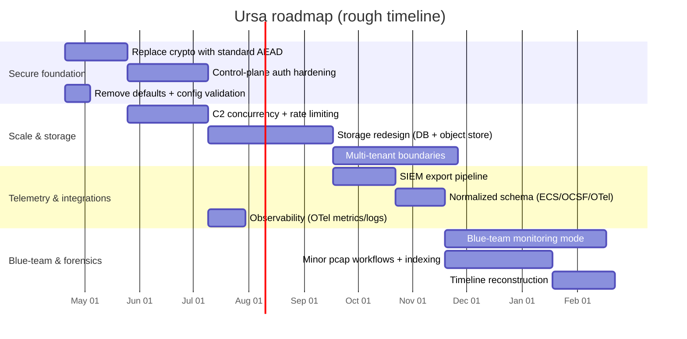
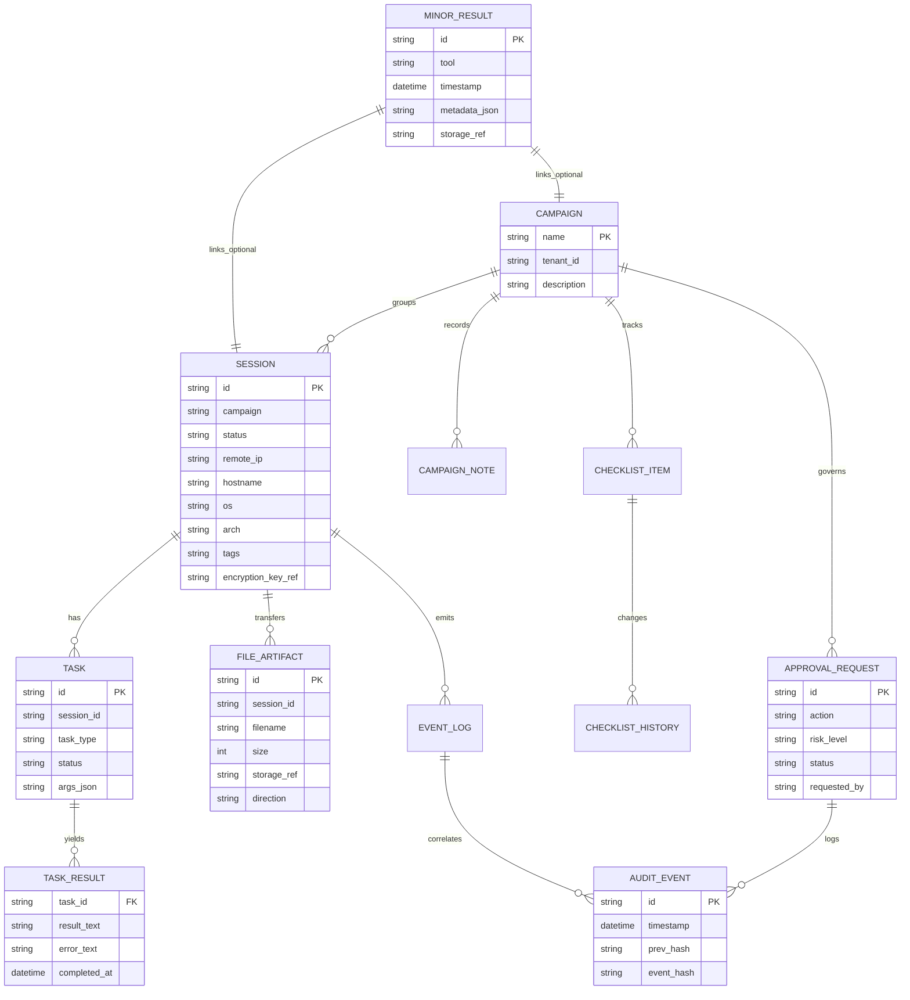

# Deep research audit of Ursa in Bare-Systems/Ursa

## Executive summary

Ursa is positioned as an “AI-native red team operations platform” built around Model Context Protocol (MCP), with two major components: **Ursa Major** (a long-running HTTP C2 plus a separate control-plane service) and **Ursa Minor** (a recon/scanning + lightweight host triage toolkit exposed via MCP/CLI/scripts). The repository also contains an “implants” subsystem (Python/Go/Zig templates) and a growing set of post-exploitation modules. fileciteturn51file0L1-L1

From a repository audit, Ursa already has unusually strong *operational governance* for an early-stage C2—step-up approvals, a task risk matrix, campaign policies/threshold alerts, and an append-only hash-chained audit log are first-class concepts. fileciteturn33file0L1-L1 fileciteturn32file0L1-L1

The most urgent technical finding is that the project’s cryptography story is inconsistent across docs and code: docs describe “AES-256-CTR + HMAC-SHA256” for per-session encryption, but the implementation in `major/crypto.py` explicitly states it is **not** AES and uses a SHA-256–derived keystream construction instead. This is a high-severity security risk (and a credibility risk) that should be addressed before any serious deployment. fileciteturn52file0L1-L1 fileciteturn29file0L1-L1

Comparing Ursa to mature industry tools, Ursa Major overlaps with C2 frameworks in basic session/tasking, but it is far behind on hardening (HA, multi-operator concurrency, proven crypto transports, robust access control, mature implant ecosystems). Ursa Minor overlaps with point features from packet tools and DFIR platforms, but it lacks core “forensics-grade” capabilities (pcap workflows, timeline reconstruction, evidence custody, memory artifact pipelines). In exchange, Ursa has a “human + AI operator workflow” focus plus governance mechanics that are more explicit than many offensive frameworks. fileciteturn51file0L1-L1 fileciteturn52file0L1-L1 fileciteturn53file0L1-L1

Because the repository includes clearly offensive functionality (e.g., implants, credential spraying, reverse-shell generation, and evasion primitives), any roadmap should treat **legal/ethical safeguards and “secure-by-default” controls as core product requirements**, not documentation afterthoughts. fileciteturn51file0L1-L1 fileciteturn53file0L1-L1 fileciteturn54file0L1-L1

## Repository audit of current architecture, modules, and code

Ursa’s top-level architecture is explicitly “AI Agent ↔ MCP ↔ (Major + Minor),” where Major provides a C2 server plus a control-plane surface, and Minor provides recon/triage tools. fileciteturn51file0L1-L1

### Ursa Major surfaces and responsibilities

Ursa Major is split into:
- a **C2 listener** (HTTP endpoints for implants: register/beacon/result/upload/download/stage), and
- a **control-plane service** (FastAPI) that exposes bearer-authenticated REST endpoints under `/api/v1/*` and an MCP endpoint under `/mcp`, backed by a shared SQLite datastore. fileciteturn52file0L1-L1 fileciteturn37file0L1-L1

The C2 server logic lives in `major/server.py` and uses a simple HTTP handler + a traffic-profile router that can remap C2 endpoints to “legitimate-looking” paths and headers. fileciteturn30file0L1-L1 fileciteturn34file0L1-L1

The control plane (`major/web/app.py`) is explicitly not intended as a full operator UI; it returns HTTP 410 for direct UI routes and indicates that a separate external UI (“BearClawWeb”) is meant to be the only operator-facing surface. fileciteturn35file0L1-L1

### Governance and audit mechanics

Governance is unusually prominent:
- A task risk matrix classifies actions into low/medium/high/critical, with special handling for `shell` commands based on risky tokens and command length. fileciteturn33file0L1-L1
- A step-up approval workflow is available (config-driven), including bulk remediation actions and recommendations. fileciteturn33file0L1-L1
- The database schema includes `approval_requests` and `immutable_audit`, and there is a chain verification function to detect tampering of the audit chain. fileciteturn32file0L1-L1
- Approval decisions can be signed using HMAC with a configured signing key (but the default key is a static dev value, which is a deployment hazard). fileciteturn33file0L1-L1

### Storage model

Major uses SQLite in WAL mode with tables for sessions, tasks, transferred files (as BLOB), events, approvals, and the immutable audit chain, plus “campaign ops” tables (notes, checklists, playbooks, policies) and a users table with PBKDF2-based password hashing. fileciteturn32file0L1-L1

This schema already supports many “ops hygiene” workflows (handoff notes, checklists, campaign timelines), which is aligned with the repo’s stated goal of structured workflows and human oversight. fileciteturn32file0L1-L1 fileciteturn37file0L1-L1

### Crypto and transport

Documentation claims per-session AES-256-CTR + HMAC-SHA256 encryption. fileciteturn51file0L1-L1 fileciteturn52file0L1-L1

However, `major/crypto.py` states the current implementation is **not** AES, and implements a SHA-256–based keystream generator (CTR-like) plus HMAC. fileciteturn29file0L1-L1

This mismatch is one of the most important “stop-ship” risks: security reviewers (and internal stakeholders) will treat it as a cryptographic footgun until replaced with a standard, reviewed construction.

### Ursa Minor scope and implementation

Ursa Minor is positioned as a 20-tool recon/scanning + host-defense triage suite, delivered as:
- an MCP server (`minor/src/ursa_minor/server.py`),
- a minimal CLI wrapper (`minor/src/ursa_minor/cli.py`),
- and standalone scripts under `minor/`. fileciteturn53file0L1-L1 fileciteturn41file0L1-L1

Minor includes both network-facing recon helpers (ARP discovery, port scanning, sniffing) and endpoint triage capabilities (persistence scanning, baselines, diffing, report export). fileciteturn40file0L1-L1 fileciteturn39file0L1-L1

A notable design choice: Minor auto-saves tool output to a structured results store (JSON on disk) and supports exporting results to JSON/CSV/HTML and bundling an “engagement report.” fileciteturn39file0L1-L1

### Implants and post modules

The implants subsystem includes a Python beacon, a Go beacon template, and a Zig skeleton; plus a builder that substitutes `URSA_*` tokens and can optionally obfuscate the resulting payload. fileciteturn54file0L1-L1

The repository also includes “post” modules with a loader/registry and at least some implemented enumeration modules (e.g., `enum/sysinfo`, `enum/loot`) that correlate findings into a severity-ranked report. fileciteturn42file0L1-L1 fileciteturn44file0L1-L1 fileciteturn45file0L1-L1

## Repo-based feature, gap, debt, and risk table

The table below is grounded in the repository’s code and docs (not aspirational feature lists). It summarizes what exists, what’s missing relative to your requested feature set, where technical debt is visible, and where security risks are most concentrated.

| Area | What exists in repo (evidence) | Missing / weak vs. requested feature set | Technical debt / implementation gap | Security & privacy risk |
|---|---|---|---|---|
| Major architecture surfaces | C2 listener + separate control plane with REST `/api/v1/*` and MCP `/mcp`, shared DB/config. fileciteturn52file0L1-L1 | Clear separation of “data plane” vs “control plane” exists, but platform hardening patterns (HA, multi-instance, queueing) are not present. | Documentation references deployment artifacts (compose/blink) that appear absent (fetch failures in audit), suggesting drift between docs and repo reality. fileciteturn52file0L1-L1 | N/A |
| Session/tasking core | Session lifecycle + task queue + result submission + file transfers in DB. fileciteturn30file0L1-L1 fileciteturn32file0L1-L1 | Multi-tenant isolation, prioritization queues, scheduling, and robust agent upgrade channels not implemented. | SQLite + simple HTTP server design will bottleneck with many sessions. fileciteturn32file0L1-L1 fileciteturn30file0L1-L1 | C2 endpoints are inherently sensitive; access control model must be strict. |
| Crypto & secure comms | Per-session encryption code exists. fileciteturn29file0L1-L1 | Standard, reviewed crypto transport (TLS+mTLS, AEAD) not implemented end-to-end; docs claim “AES-256-CTR” but code is not AES. fileciteturn52file0L1-L1 fileciteturn29file0L1-L1 | Doc/code mismatch; no KMS/secret rotation; keys stored in plaintext in DB schema. fileciteturn32file0L1-L1 | High: bespoke crypto is difficult to validate and increases compromise risk. |
| Auth/RBAC | Bearer-token auth for API; role checks based on a role header; local “users” table exists. fileciteturn36file0L1-L1 fileciteturn32file0L1-L1 | Strong operator identity, MFA/SSO, scoped tokens, and separation of duties are not complete; header-driven role is weak. fileciteturn36file0L1-L1 | Mixed auth strategies across surfaces; defaults include dev secrets. fileciteturn35file0L1-L1 fileciteturn33file0L1-L1 | High: token leakage or header spoofing leads to full control-plane compromise. |
| Governance & audit | Risk matrix + step-up approvals + policy alerts + hash-chained immutable audit; campaign checklists/notes/playbooks. fileciteturn33file0L1-L1 fileciteturn32file0L1-L1 | Integrations with enterprise GRC (ticketing workflows, approvals in IAM) not present. | Audit chain uses SHA-256 linking but not clearly anchored to external immutability (e.g., append-only store). fileciteturn32file0L1-L1 | Medium: audit record integrity depends on DB trust boundary. |
| Traffic profiles / “malleability” | Traffic profile abstraction remaps URLs, headers, and optional UA filter; built-in profiles included. fileciteturn34file0L1-L1 | Rich profile “linting,” simulation, and robust coverage similar to mature “malleable C2” ecosystems not present. | Docs show “office365” paths that don’t match code’s Graph-like paths; indicates drift. fileciteturn52file0L1-L1 fileciteturn34file0L1-L1 | High risk if used to evade oversight; must be governance-gated and legally controlled. |
| Monitoring / blue-team mode | Minor has packet sniffing and host baselines; Major has event log + campaign timeline. fileciteturn40file0L1-L1 fileciteturn39file0L1-L1 fileciteturn32file0L1-L1 | No full NDR/NIDS pipeline: no Zeek-style structured protocol logs, Suricata-style alert stream, anomaly detection, or SIEM-grade schemas. | Monitoring features are not unified into a normalized telemetry model (ECS/OCSF/OTel). | Medium: collecting network/host telemetry introduces privacy obligations and retention controls. |
| Minor result persistence & reporting | Auto-save results, export JSON/CSV/HTML, engagement report bundling. fileciteturn39file0L1-L1 | Evidence custody, hashing, chain-of-custody metadata, and signed exports are missing. | Results storage is local-disk JSON with minimal policy; lacks encryption-at-rest. fileciteturn39file0L1-L1 | Medium: results may contain sensitive credentials/host data; needs encryption + access controls. |
| Minor forensics depth | Live sniffing summaries exist; host triage/baselines exist. fileciteturn40file0L1-L1 fileciteturn39file0L1-L1 | Requested forensics features largely absent: pcap ingest/export workflows, timeline reconstruction, file extraction, memory forensics hooks, protocol reassembly, standardized artifact model. | Tooling is largely “quick recon” oriented, not “forensic-grade” repeatability. | Medium: improper capture handling can leak sensitive content. |
| Post modules | Loader/registry; implemented enum modules (e.g., sysinfo/loot). fileciteturn42file0L1-L1 fileciteturn45file0L1-L1 | Strong cross-platform coverage (Windows/macOS/Linux) appears incomplete; remote execution model is complex. | Base docs still discuss “local-only” execution while other parts reference remote dispatch; drift risk. fileciteturn43file0L1-L1 | High if modules enable destructive actions; needs strict policy gates + safe defaults. |
| Deployment / orchestration | Docs describe `major.cp`, `major.c2`, docker compose, and a blink-based deploy workflow. fileciteturn51file0L1-L1 fileciteturn52file0L1-L1 | HA patterns, rolling upgrades, container security, secrets management, observability are not built out in code. | Doc references to `.runtime/` and `deploy/*.yaml` suggest repo drift (audit fetch failures). fileciteturn52file0L1-L1 | High: default creds and secrets make non-local deployments unsafe. fileciteturn51file0L1-L1 |
| Testing | A tests harness exists (`tests/`), but breadth is unclear from available artifacts. fileciteturn25file0L1-L1 | No demonstrated protocol test vectors for crypto; no load tests; no fuzzing; no SBOM pipeline. | Potential mismatch between evolving surfaces (C2 vs control-plane vs MCP entrypoints). | Medium: lack of regression tests increases risk of breaking security invariants. |

## Feature-by-feature comparison to leading tools and gap analysis

This section compares **Ursa Major + Ursa Minor** to a representative set of widely used tools across offensive C2, endpoint DFIR, and network monitoring. Because these tools address different parts of the lifecycle, the comparison focuses on *capability primitives* (transport, scaling model, telemetry, extensibility, governance, and operator UX).

### Anchor points from official sources

- **Cobalt Strike** emphasizes malleable C2 profiles to transform/shape beacon traffic and “blend,” and includes validation tooling (c2lint). citeturn4search3  
- **Sliver** (by entity["company","Bishop Fox","security consultancy"]) advertises cross-platform implants with C2 transports including mTLS, HTTP(S), DNS, and WireGuard, with per-binary certificates and “multiplayer mode.” citeturn4search4  
- **Metasploit Framework** (by entity["company","Rapid7","security company"]) documents staged payload composition and Meterpreter’s modular architecture. citeturn4search1turn4search0  
- **GRR Rapid Response** (developed by entity["company","Google","technology company"]) is a client/server remote live forensics platform built for scale, with hunts and approvals as an “advanced feature.” citeturn7search5turn7search0  
- **Velociraptor** centers on VQL “artifacts” as reusable, server-managed collections and hunts. citeturn4search2turn4search6  
- **Zeek** separates detection from reporting via its Notice framework and extensive policy scripting/logging. citeturn6search0turn6search3  
- **Suricata** outputs rich JSON telemetry (EVE) for alerts, metadata, and protocol logs, and supports `tenant_id` reporting for multi-tenant configurations. citeturn5search0  
- **Wireshark** documents deep packet capture/analysis, filters, and dissectors in its user guide. citeturn6search1  
- **Sysmon** (entity["company","Microsoft","software vendor"]) logs process/network/file events into Windows event logs for downstream collection and analysis. citeturn6search2  

### Comparison matrix

Legend: ✅ strong/native ◐ partial/early ❌ not present / not a focus

| Feature primitive | Ursa Major | Ursa Minor | Cobalt Strike | Sliver | Metasploit | GRR | Velociraptor | Zeek | Suricata | Wireshark |
|---|---:|---:|---:|---:|---:|---:|---:|---:|---:|---:|
| Long-running agent/session mgmt | ✅ sessions/tasks/db fileciteturn32file0L1-L1 | ❌ | ✅ citeturn4search3 | ✅ citeturn4search4 | ✅ (sessions/payloads) citeturn4search1turn4search0 | ✅ citeturn7search5 | ✅ citeturn4search6 | ❌ | ❌ | ❌ |
| Proven secure transports | ◐ (TLS optional; crypto mismatch) fileciteturn29file0L1-L1 | ◐ (tool-specific) fileciteturn40file0L1-L1 | ✅ (mature) citeturn4search3 | ✅ (mTLS/WireGuard/DNS) citeturn4search4 | ✅ (varies by payload) citeturn4search0turn4search1 | ✅ citeturn7search5 | ✅ citeturn4search6 | N/A | N/A | N/A |
| C2 traffic shaping / profiles | ✅ traffic profiles fileciteturn34file0L1-L1 | ❌ | ✅ malleable C2 citeturn4search3 | ◐ (multiple transports) citeturn4search4 | ◐ | ❌ | ❌ | ❌ | ❌ | ❌ |
| Governance: approvals/audit | ✅ step-up approvals + audit chain fileciteturn33file0L1-L1 fileciteturn32file0L1-L1 | ◐ (local only) fileciteturn39file0L1-L1 | ◐ (varies) | ◐ | ◐ | ✅ approvals at scale citeturn7search0turn7search5 | ◐ (org/hunt controls) citeturn4search2 | ◐ (notice policy hooks) citeturn6search0 | ◐ (tenant-aware logging) citeturn5search0 | ❌ |
| Endpoint DFIR primitives (file/process/memory triage at scale) | ◐ (post modules exist) fileciteturn45file0L1-L1 | ✅ host baselines/triage fileciteturn40file0L1-L1 | ❌ | ❌ | ◐ | ✅ citeturn7search5 | ✅ citeturn4search6 | ❌ | ❌ | ❌ |
| Network security monitoring pipeline | ❌ (no Zeek/Suricata pipeline) | ◐ (basic sniff summary) fileciteturn38file0L1-L1 | ❌ | ❌ | ❌ | ❌ | ◐ | ✅ citeturn6search0 | ✅ EVE JSON citeturn5search0 | ◐ (analysis, not NDR) citeturn6search1 |
| Packet capture + deep analysis | ❌ | ◐ (scapy-based sniffing) fileciteturn38file0L1-L1 | ❌ | ❌ | ❌ | ◐ | ◐ | ◐ | ◐ | ✅ citeturn6search1 |
| Telemetry schema standardization | ❌ (custom db/event log) fileciteturn32file0L1-L1 | ◐ (structured JSON) fileciteturn39file0L1-L1 | ❌ | ❌ | ❌ | ◐ | ◐ | ✅ logs | ✅ EVE JSON citeturn5search0 | ❌ |

### Gap analysis distilled

Ursa’s biggest structural gaps—relative to mature tools—cluster into four themes:

Ursa Major hardening gaps: **standard crypto, robust authz, HA/scaling, and safe-by-default operational controls**. The repo already acknowledges control-plane bootstrap credentials that must be changed before non-local deployments, underscoring current deployment risk. fileciteturn51file0L1-L1

Ursa Minor forensic depth gaps: **pcap workflows (save/import), timeline modeling, evidence controls, and integration into a larger DFIR pipeline**. Minor currently prioritizes “quick recon + structured autosave” rather than “forensic-grade repeatability.” fileciteturn39file0L1-L1 fileciteturn40file0L1-L1

Blue-team monitoring gaps: There is no Zeek-style policy scripting/log pipeline, nor Suricata-style structured alert/protocol output stream and multi-tenant logging integration. citeturn6search0turn5search0

Schema + SIEM integration gaps: No first-class adoption of widely used schemas (e.g., ECS, OTel semantic conventions, OCSF) even though these standards exist precisely to normalize event/metric/log data for downstream analysis. citeturn8search1turn8search5turn9search0

## Prioritized roadmap with feature specs, implications, dependencies, and timeline

Roadmap estimates assume “no specific constraint,” but for realism the time ranges below assume a small dedicated team (roughly 3–5 engineers/devops) and include validation work.

### Roadmap backlog table

S/M/L complexity is engineering complexity; time is rough elapsed time (not only coding). “Dependencies” indicates prerequisite milestones.

| Feature / enhancement | Description | Priority | Complexity | Security & privacy implications | Suggested OSS libs / protocols | Testing & validation approach | Dependencies | Est. time |
|---|---|---:|---:|---|---|---|---|---:|
| Replace non-standard crypto with AEAD | Replace SHA-based keystream scheme with standard AEAD (e.g., TLS+mTLS, or ChaCha20-Poly1305 / AES-GCM). Align docs and code. | High | L | Reduces catastrophic cryptographic risk; enables compliance review. | `cryptography` (Python), TLS 1.3, mTLS; consider Noise protocol patterns for non-TLS. | Known-answer test vectors; interoperability tests; property tests; fuzz message framing. | None | 3–6 w |
| Control-plane auth hardening | Replace “role from header” model with signed identities: scoped tokens, server-side RBAC/ABAC, rotation, optional OIDC/SSO. | High | L | Prevent privilege spoofing; supports auditability and least privilege. | OAuth2/OIDC, JWT w/ audience+expiry, mTLS for service-to-service. | Authz unit tests, negative tests, token replay tests, threat modeling. | Crypto milestone | 3–8 w |
| Secrets & default removal | Eliminate dev defaults (`change-me-now`, dev signing keys); enforce startup fail-fast if defaults present in non-dev mode. | High | M | Prevents accidental exposure in real deployments. | `pydantic-settings` or config validation; secret scanners. | CI checks; config linting; container image scanning. | None | 1–2 w |
| Concurrency + scalability for C2 listener | Move from single-thread handler to scalable model (async server or ThreadingHTTPServer), backpressure, and rate limits. | High | L | Reduces DoS risk; improves reliability. | FastAPI/uvicorn for data plane or a dedicated async server; token bucket rate limiting. | Load tests, soak tests, chaos tests (restart, network loss). | Crypto | 3–8 w |
| Storage redesign for scale | Replace SQLite BLOB storage with object store; move to Postgres or split stores (metadata in DB, payloads in object store). | High | L | Improves multi-user safety, retention controls, and performance. | PostgreSQL; S3-compatible object stores; migrations via Alembic. | Migration tests; data integrity checks; perf benchmarks. | Concurrency | 4–10 w |
| SIEM integration pipeline | Export events/tasks/audit/telemetry into SIEM-friendly streams (e.g., JSON over syslog, Splunk HEC, Elastic). | High | M | Must avoid leaking sensitive payloads; support redaction policies. | entity["company","Splunk","siem vendor"] HEC format citeturn8search3turn8search0; ECS mapping entity["company","Elastic","search and analytics company"] citeturn8search1 | Golden-schema tests; redaction tests; end-to-end ingestion in a test SIEM. | Auth + storage | 3–6 w |
| Normalized telemetry schema | Adopt ECS or OCSF for events + resources, and/or OpenTelemetry semantic conventions for metrics/logs. | High | M | Improves downstream analytics and cross-tool correlation. | ECS citeturn8search1; OTel semantic conventions citeturn8search5; OCSF citeturn9search0 | Schema validation; contract tests; mapping reviews. | SIEM pipeline | 2–5 w |
| Multi-tenant boundaries | Add explicit tenant/org model: tenant_id on all records; per-tenant keys; per-tenant retention; RBAC scoping. | High | L | Required for true multi-tenant ops; reduces data leakage. | Postgres RLS, tenant-aware encryption, per-tenant KMS keys. | RLS tests; data isolation tests; penetration testing. | Storage redesign | 4–10 w |
| Observability & SLOs | Add metrics/logging/tracing (control plane + C2) with OTel. | Medium | M | Helps detect abuse, outages, and anomalous activity. | OpenTelemetry citeturn8search5turn8search6 | SLO dashboards; alert tests; synthetic probes. | Concurrency | 2–4 w |
| Blue-team monitoring mode | Implement a *defensive* monitoring pipeline: integrate Zeek/Suricata outputs, correlate to sessions/campaigns, and build anomalies/alerts. | Medium | L | Significant privacy impact; must include consent/retention/redaction. | Zeek Notice/log model citeturn6search0; Suricata EVE JSON citeturn5search0 | Replay pcaps; detection regression suites; alert fidelity tests. | Telemetry schema | 6–16 w |
| Minor: forensics-grade pcap workflows | Add save/import pcaps, indexed flow summaries, protocol reassembly hooks, export artifacts. | Medium | L | Evidence handling policies needed; avoid capturing unnecessary payloads. | libpcap/pcapy; Zeek logs; Suricata EVE; Wireshark-compatible formats citeturn6search1 | Deterministic pcap test set; file hashing; reproducible reports. | Telemetry schema | 4–10 w |
| Minor: timeline reconstruction | Build a unified timeline from host baselines + network observations + Major events. | Medium | M | Must support redaction and minimization. | STIX/TAXII optional for CTI interchange citeturn9search7turn9search6; OCSF event classes citeturn9search0 | Timeline correctness tests; cross-source deduplication tests. | Normalized schema | 2–6 w |
| Integration with endpoint telemetry | Add connectors for Sysmon + event collection, osquery-like artifacts, etc. | Medium | L | Endpoint data is sensitive; strong access + retention required. | Sysmon event model citeturn6search2; ECS normalization citeturn8search1 | Agent-collection test benches; parsing tests; SIEM end-to-end. | Schema + SIEM | 4–12 w |
| Harden Minor’s “high-risk” tools surface | Gate sensitive actions behind explicit approvals (similar to Major), allow disable-by-default, and require policy justification metadata in results. | High | M | Reduces misuse risk; supports compliance posture. | Reuse Major governance policy model fileciteturn33file0L1-L1 | Policy enforcement tests; audit completeness tests. | Auth hardening | 2–4 w |
| Documentation & drift control | Generate docs from code (OpenAPI, tool registry), remove stale references (missing ROADMAP/compose files), keep a real CHANGELOG. | High | S | Prevents operator errors that become security incidents. | OpenAPI generation; CI doc checks. | Doc CI; link checkers; “docs match code” assertions. | None | 1–3 w |

### Milestones and dependencies

Milestone “Secure foundation” (Crypto + auth + secrets) is the critical path: until cryptography and operator authentication/authorization are standard and enforceable, the rest of the platform cannot safely evolve. The repo itself warns against unauthorized use and highlights default bootstrap credentials, underscoring this priority. fileciteturn51file0L1-L1

Milestone “Scale + store” (concurrency + DB/object store) follows because multi-tenant support, HA, and SIEM exports depend on reliable persistence and backpressure.

Milestone “Telemetry + SIEM” unlocks blue-team monitoring, correlation, and anomaly detection: adopting common schemas like ECS/OCSF and semantics like OpenTelemetry drastically reduces long-term integration cost. citeturn8search1turn9search0turn8search5

Milestone “Forensics-grade Minor” is best treated as a separate track, aligned with DFIR patterns from platforms like GRR and Velociraptor (artifacts, hunts, repeatable collections). citeturn7search5turn4search2

### Roadmap timeline chart



## Recommended architecture patterns, deployment options, and integrations

### Architecture patterns to adopt

Ursa already separates “C2 listener” from “control plane.” The next step is making that separation *intentional and enforceable*:

Data plane (C2 ingestion): Treat implant/beacon ingestion as a minimal, hardened, rate-limited service. Keep the surface small and stable. fileciteturn52file0L1-L1

Control plane (operator + governance): Centralize RBAC, approvals, audit, reporting, and SIEM export from here. The repo already exposes a dedicated REST API and MCP endpoint for this purpose. fileciteturn37file0L1-L1

Asynchronous work model: Mature DFIR platforms emphasize scalable task dispatch (“hunts,” collections) and robust server-side orchestration. GRR explicitly frames this as scheduling actions on clients and supporting “remote forensics at scale.” citeturn7search5

Artifact-driven extensibility: Velociraptor’s “artifacts as reusable YAML definitions of VQL collections” is a proven model for extensibility while keeping operator UX discoverable. citeturn4search2

### Deployment options

Single-node dev (today): `major.c2` + `major.cp` with a local SQLite DB is aligned with the repo’s quick start. fileciteturn51file0L1-L1

On-prem production (recommended first target): Consolidate control plane + ingestion behind a reverse proxy; enforce mTLS or network segmentation; integrate SIEM export. Use Sysmon-like host telemetry streams if you intend blue-team use. citeturn6search2

Cloud/hybrid: Only after secrets, auth, and crypto are addressed. When cloud is introduced, adopt a standard schema model (ECS/OCSF) for logs and metrics; this enables multi-platform ingestion and cross-tool correlation. citeturn8search1turn9search0

### Integration points

SIEM ingestion:
- Splunk HEC provides a standard HTTP token ingestion path for JSON events. citeturn8search3turn8search0
- Elastic ECS defines fields like `event.*` that normalize event semantics across sources. citeturn8search1

Endpoint telemetry:
- Sysmon produces process/network/file activity into Windows event logs for downstream analysis; Ursa should treat this as a *blue-team telemetry intake* option, not a C2 feature. citeturn6search2

Network monitoring:
- Zeek provides logs + notice policy hooks; Suricata provides JSON “EVE” output and multi-tenant `tenant_id` in logs. citeturn6search0turn5search0

Threat intel exchange (optional):
- STIX defines a machine-readable CTI exchange format; TAXII defines the transport API for CTI exchange. entity["organization","OASIS","standards consortium"] citeturn9search7turn9search6
- MITRE ATT&CK provides a common language for adversary behaviors and defensive mapping (useful for reporting and control frameworks). entity["organization","MITRE","public interest org"] citeturn9search2

### Suggested data schemas

A practical approach is:
- Use **ECS** for SIEM-facing event normalization (host/process/network/event fields) citeturn8search1  
- Use **OpenTelemetry** conventions for metrics/log semantic naming and exporter compatibility citeturn8search5  
- Optionally map into **OCSF** event classes if a vendor-agnostic security-event taxonomy is desired citeturn9search0  

Example “normalized event” shape (conceptual), aligning with ECS-style concepts:

```json
{
  "event": { "kind": "event", "category": ["network"], "action": "connection" },
  "host": { "name": "host1" },
  "source": { "ip": "10.0.0.10", "port": 51514 },
  "destination": { "ip": "10.0.0.20", "port": 443 },
  "ursa": { "campaign": "acme-2026q2", "session_id": "abcd1234", "tool": "sniff_packets" }
}
```

(ECS defines the role of `event.*` fields for log semantics. citeturn8search1)

### Mermaid ER diagram for Major–Minor interactions and telemetry flow



This extends the schema that already exists in `major/db.py` (sessions/tasks/files/event_log/approval_requests/immutable_audit) and adds a safe “reference” model for file payloads rather than storing them as DB BLOBs. fileciteturn32file0L1-L1 fileciteturn39file0L1-L1

## Sample UX flows and interaction examples

The repository is explicit that Ursa is intended for authorized security testing and should not be used without permission. fileciteturn51file0L1-L1  
Accordingly, the examples below focus on **defensive/administrative workflows** (triage, baselines, reporting, governance) rather than “how to run intrusions.”

### Ursa Minor CLI and MCP UX flows (defensive-oriented)

Minor is packaged with a minimal CLI entrypoint that starts its MCP server. fileciteturn41file0L1-L1

Flow: start Minor MCP server and run a host triage report
1) Start server:
```bash
ursa mcp serve
```
(Minor’s README documents `ursa mcp serve` once installed. fileciteturn53file0L1-L1)

2) In an MCP-capable client, run `triage_host` to produce a baseline triage artifact and autosave to results storage. Minor’s MCP server exposes `triage_host`, `create_baseline`, and `baseline_diff`. fileciteturn40file0L1-L1

3) Export an engagement report: Minor supports exporting individual results and bundling multi-result engagement reports in HTML/JSON/CSV. fileciteturn39file0L1-L1

Flow: evidence-friendly result handling (what to add)
Minor already stores results as JSON and can export HTML, but it does not yet hash/sign results with chain-of-custody metadata. That is the natural next UX enhancement: every save should include hash, tool version, and policy metadata (who/why), and exports should include a signed manifest.

### Ursa Major control-plane UX flows (governance + reporting)

Major’s control-plane service exposes `/api/v1/*` endpoints for sessions/tasks/events/campaigns/governance and a `/healthz` endpoint for health checks. fileciteturn52file0L1-L1 fileciteturn35file0L1-L1

Flow: governance-first campaign operations
- Use campaign grouping, notes, and checklists to organize operations; Major’s DB schema includes campaign notes/checklist/playbooks and a unified timeline across events/tasks/approvals/notes/checklist history. fileciteturn32file0L1-L1 fileciteturn37file0L1-L1
- Use policy thresholds and remediation recommendations to prevent backlog buildup for risky task approvals. fileciteturn33file0L1-L1

Flow: API access control expectations (what to change)
Major’s bearer token auth validates a shared API token, but the “actor” and “role” are currently accepted from headers and normalized, not derived from a signed identity. fileciteturn36file0L1-L1  
This should evolve toward signed claims (or SSO) and least-privilege tokens before multi-user deployments.

### Major–Minor integration UX (recommended target state)

Ursa’s architecture already anticipates “AI agent uses both Major and Minor,” but today Minor results are local JSON files while Major uses a central DB. fileciteturn51file0L1-L1 fileciteturn39file0L1-L1

A high-leverage integration point is: **Minor posts structured results to Major as first-class artifacts** associated with `campaign` and optionally `session_id`. This enables:
- shared reporting and handoff in Major’s campaign timeline, fileciteturn32file0L1-L1
- normalized SIEM export, citeturn8search3turn8search1
- and governance metadata (why the scan was run, what policy applied).

## Closing synthesis

Ursa is already differentiated by its “operator governance + AI-operable MCP” framing and by having campaign ops and approval workflows that many offense-first frameworks treat as out-of-scope. fileciteturn51file0L1-L1 fileciteturn33file0L1-L1

To reach “industry-leading” maturity in the categories you listed, the near-term work must concentrate on **foundational safety and correctness** (standard crypto, hardened authn/authz, secrets handling, scale/storage). The mid-term work should focus on **schema + SIEM integration and a true blue-team telemetry pipeline** inspired by Zeek/Suricata and endpoint DFIR patterns from GRR and Velociraptor—where normalized outputs, repeatable artifacts, and scalable collection are the core primitives. citeturn6search0turn5search0turn7search5turn4search2